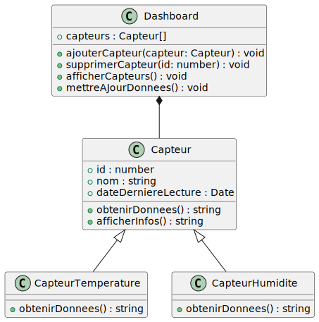

# Gestion des Capteurs et Tableau de Bord


Ce projet met en place un système de gestion de capteurs génériques et spécialisés (température et humidité) via un tableau de bord interactif. Les capteurs génèrent des données dynamiques affichées sur une interface utilisateur simple.

---

## Classes et Fonctionnalités

### 1. Classe `Capteur`
```bash
class Capteur {
    constructor(id, nom) {
      this.id = id;
      this.nom = nom;
      this.dateDerniereLecture = null;
    }
  
    obtenirDonnees() {
      this.dateDerniereLecture = new Date();
      return "Données du capteur";
    }
  
    afficherInfos() {
      return `[${this.id}] ${this.nom}`;
    }
  }
```

#### Rôle
Représente un capteur générique avec des propriétés et des méthodes communes.

#### Propriétés
- `id` : Identifiant unique du capteur.
- `nom` : Nom du capteur.
- `dateDerniereLecture` : Stocke la date/heure de la dernière lecture des données.

#### Méthodes
- **`obtenirDonnees()`** :
  - Met à jour `dateDerniereLecture` avec la date actuelle.
  - Retourne un message générique : `"Données du capteur"`.
- **`afficherInfos()`** :
  - Retourne une chaîne formatée contenant l’identifiant et le nom du capteur, comme `[id] nom`.

---

### 2. Classe `CapteurTemperature`
```bash
class CapteurTemperature extends Capteur {
    obtenirDonnees() {
      super.obtenirDonnees();
      const temperature = (Math.random() * 30).toFixed(2);
      return `Température : ${temperature}°C`;
    }
  }
```

#### Héritage
Hérite de la classe `Capteur` et représente un capteur spécialisé pour la température.

#### Méthode redéfinie
- **`obtenirDonnees()`** :
  - Appelle `obtenirDonnees()` de la classe parent (`super.obtenirDonnees()`) pour mettre à jour la date.
  - Génère une température aléatoire entre 0 et 30 (arrondie à 2 décimales).
  - Retourne une chaîne formatée comme : `Température : xx.xx°C`.
---
### 3. Classe `CapteurHumidite`
```bash
class CapteurHumidite extends Capteur {
    obtenirDonnees() {
      super.obtenirDonnees();
      const humidite = (Math.random() * 100).toFixed(2);
      return `Humidité : ${humidite}%`;
    }
  }
```
#### Héritage
Hérite de la classe `Capteur` et représente un capteur spécialisé pour l'humidité.

#### Méthode redéfinie
- **`obtenirDonnees()`** :
  - Appelle `obtenirDonnees()` de la classe parent pour mettre à jour la date.
  - Génère une humidité aléatoire entre 0 et 100 (arrondie à 2 décimales).
  - Retourne une chaîne formatée comme : `Humidité : xx.xx%`.
---

### 4. Classe `Dashboard`

#### Rôle
Gère la liste des capteurs, leur affichage et les interactions avec l'interface utilisateur.

#### Propriétés
- `capteurs` : Tableau contenant les objets capteurs.

#### Méthodes
- **`ajouterCapteur(capteur)`** :
  - Ajoute un capteur au tableau `capteurs`.
  - Met à jour l’affichage en appelant `afficherCapteurs()`.

- **`supprimerCapteur(id)`** :
  - Supprime le capteur correspondant à l’identifiant donné.
  - Met à jour l’affichage en appelant `afficherCapteurs()`.

- **`afficherCapteurs()`** :
  - Sélectionne le conteneur HTML avec l’ID `dashboard`.
  - Réinitialise son contenu avec `innerHTML = ""`.
  - Pour chaque capteur dans `capteurs` :
    - Crée un élément `<div>` représentant le capteur.
    - Ajoute un bouton "Supprimer" avec une fonction `onclick` pour appeler `supprimerCapteur()`.

- **`mettreAJourDonnees()`** :
  - Parcourt tous les capteurs et met à jour les données affichées pour chacun en remplaçant le contenu de l'élément HTML correspondant.

---

### 5. Fonctionnalités du Tableau de Bord

Les fonctions suivantes permettent d’interagir avec le tableau de bord via l'interface utilisateur :

- **`ajouterCapteurTemperature()`** :
  - Crée un nouvel objet `CapteurTemperature` avec un ID unique.
  - Ajoute ce capteur au tableau de bord via `dashboard.ajouterCapteur()`.

- **`ajouterCapteurHumidite()`** :
  - Similaire à `ajouterCapteurTemperature()`, mais pour un `CapteurHumidite`.

- **`supprimerCapteur(id)`** :
  - Appelle la méthode `supprimerCapteur()` de l’objet `dashboard` pour retirer un capteur.

- **`mettreAJourDonnees()`** :
  - Met à jour les données affichées pour tous les capteurs.

---

### 6. Interaction avec le DOM

- Le tableau de bord est lié à une div HTML avec l’ID `dashboard`.
- Lors de l’ajout ou de la suppression d’un capteur, le tableau de bord met à jour cette div pour refléter les changements.

---

### 7. Évolution Dynamique

- Les capteurs génèrent des données aléatoires à chaque mise à jour.
- Une fois ajoutés, les capteurs sont affichés avec :
  - Leur nom.
  - Leurs données actuelles.
  - Un bouton de suppression.
- Les données peuvent être mises à jour en temps réel via la fonction `mettreAJourDonnees()`.

---
 - mettreAJourDonnees() :
  - Parcourt tous les capteurs et met à jour les données affichées pour chacun en remplaçant le contenu de l'élément HTML correspondant.
